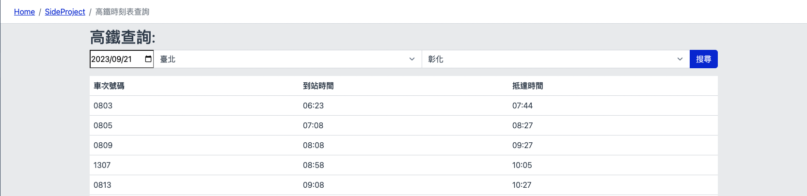

# 高鐵時刻表查詢應用程式

這是一個用於查詢台灣高鐵時刻表的程式。您可以使用它來查找高鐵列車的時刻表訊息，包括車次號碼、到站時間和抵達時間。

## 功能

此程式提供以下功能：

- 查詢指定車站之間的高鐵時刻表。
- 顯示車次號碼、到站時間和抵達時間的詳細信息。
- 可以選擇不同的出發車站和目的車站，以查詢不同路線的時刻表。

## 如何運行

要運行這個應用程式，您需要執行以下步驟：

1. 安裝相依套件：在項目資料夾中執行以下命令以安裝相依套件

2. 申請 TDX API ：此程式使用外部 API，您需要提供有效的 API 。請將您的 API 更新到 `constants.js` 檔案中的 `clientID` 和 `clientSecret`。

3. 運行應用程式：執行以下命令以啟動應用程式：

4. 使用應用程式：在瀏覽器中打開 [http://localhost:3000](http://localhost:3000) 來開始使用應用程式。

## 技術堆疊

此應用程式使用了以下技術堆疊：

- 前端：React
- 狀態管理：useState 和 useEffect 
- 外部 API：TDX API
- 使用者介面：CoreUI

## 畫面顯示

